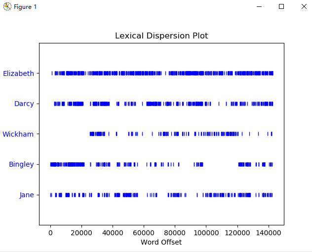
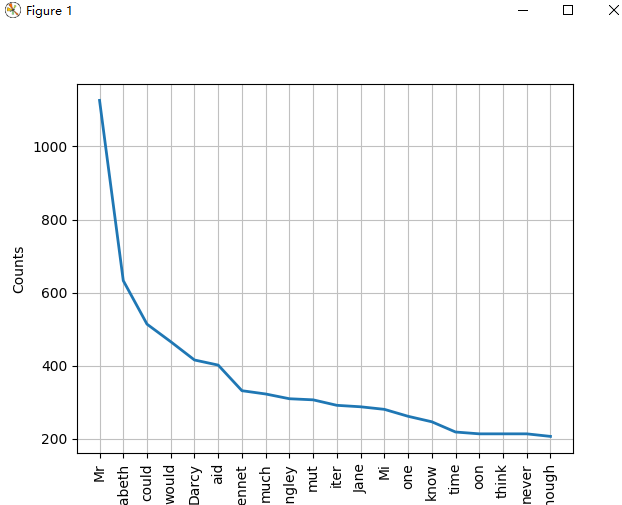

## 语言处理基础——NTLK入门及英文语料库处理

### 文本预处理

```python
# 首先读取文件，并获取单词
def readWords():
    data = ""
    with open('data/text_en.txt', 'r', encoding='utf-8-sig') as f:
        data = f.read()
    words = nltk.word_tokenize(data)
    return words
```

**（1）分词、提取词干**

```python
# 分词操作读取文件时已经完成，提取词干采用LancasterStemmer方法
def splitWordAndLancaster(words):
    stemmerlan = LancasterStemmer()
    wordsStem = [stemmerlan.stem(word) for word in words]
    return wordsStem
# 以下是输出结果的前100项
# ['the', 'project', 'gutenberg', 'ebook', 'of', 'prid', 'and', 'prejud', ',', 'by', 'jan', 'aust', 'chapt', '1', 'it', 'is', 'a', 'tru', 'univers', 'acknowledg', ',', 'that', 'a', 'singl', 'man', 'in', 'possess', 'of', 'a', 'good', 'fortun', ',', 'must', 'be', 'in', 'want', 'of', 'a', 'wif', '.', 'howev', 'littl', 'known', 'the', 'feel', 'or', 'view', 'of', 'such', 'a', 'man', 'may', 'be', 'on', 'his', 'first', 'ent', 'a', 'neighbo', ',', 'thi', 'tru', 'is', 'so', 'wel', 'fix', 'in', 'the', 'mind', 'of', 'the', 'surround', 'famy', ',', 'that', 'he', 'is', 'consid', 'the', 'right', 'property', 'of', 'som', 'on', 'or', 'oth', 'of', 'their', 'daught', '.', '``', 'my', 'dear', 'mr.', 'bennet', ',', "''", 'said', 'his', 'lady']
```

**（2）去停用词**

```python
def handleStopWords(words):
    stops = set(stopwords.words('english'))
    words = [word for word in words if word.lower() not in stops]
    return words

# 以下是输出结果的前100项
# ['Project', 'Gutenberg', 'EBook', 'Pride', 'Prejudice', ',', 'Jane', 'Austen', 'Chapter', '1', 'truth', 'universally', 'acknowledged', ',', 'single', 'man', 'possession', 'good', 'fortune', ',', 'must', 'want', 'wife', '.', 'However', 'little', 'known', 'feelings', 'views', 'man', 'may', 'first', 'entering', 'neighbourhood', ',', 'truth', 'well', 'fixed', 'minds', 'surrounding', 'families', ',', 'considered', 'rightful', 'property', 'one', 'daughters', '.', '``', 'dear', 'Mr.', 'Bennet', ',', "''", 'said', 'lady', 'one', 'day', ',', '``', 'heard', 'Netherfield', 'Park', 'let', 'last', '?', "''", 'Mr.', 'Bennet', 'replied', '.', '``', ',', "''", 'returned', ';', '``', 'Mrs.', 'Long', ',', 'told', '.', "''", 'Mr.', 'Bennet', 'made', 'answer', '.', '``', 'want', 'know', 'taken', '?', "''", 'cried', 'wife', 'impatiently', '.', '``', 'want']
```

**（3）标点符号过滤**

```python
# 中英文标点符号
def filterPunctuation(words):
    new_words=[]
    illegal_char = string.punctuation + u'.,;《》？！“”‘’@#￥%…&×（）——+【】{};；●，。&～、|\s:：'
    pattern = re.compile('[%s]'%re.escape(illegal_char))
    for word in words:
        new_word = pattern.sub(u'',word)
        if not new_word == u'':
            new_words.append(new_word)
    return new_words
# 以下是输出结果的前100项
# ['The', 'Project', 'Gutenberg', 'EBook', 'of', 'Pride', 'and', 'Prejudice', 'by', 'Jane', 'Auten', 'Chapter', '1', 'It', 'i', 'a', 'truth', 'univerally', 'acknowledged', 'that', 'a', 'ingle', 'man', 'in', 'poeion', 'of', 'a', 'good', 'fortune', 'mut', 'be', 'in', 'want', 'of', 'a', 'wife', 'However', 'little', 'known', 'the', 'feeling', 'or', 'view', 'of', 'uch', 'a', 'man', 'may', 'be', 'on', 'hi', 'firt', 'entering', 'a', 'neighbourhood', 'thi', 'truth', 'i', 'o', 'well', 'fixed', 'in', 'the', 'mind', 'of', 'the', 'urrounding', 'familie', 'that', 'he', 'i', 'conidered', 'the', 'rightful', 'property', 'of', 'ome', 'one', 'or', 'other', 'of', 'their', 'daughter', 'My', 'dear', 'Mr', 'Bennet', 'aid', 'hi', 'lady', 'to', 'him', 'one', 'day', 'have', 'you', 'heard', 'that', 'Netherfield', 'Park']
```

**（4）低频词过滤（n <= threshold）**

```python
def filterLowFrequency(words):
    threshold = 20
    new_words = []
    fdist = FreqDist(words)
    for word in fdist:
        if fdist[word] > threshold:
            new_words.append(word)
    return new_words 

# 以下是输出结果的前100项
# ['The', 'of', 'and', ',', 'by', 'Jane', 'Chapter', 'It', 'is', 'a', 'truth', 'that', 'man', 'in', 'good', 'fortune', 'must', 'be', 'want', 'wife', '.', 'little', 'known', 'the', 'feelings', 'or', 'such', 'may', 'on', 'his', 'first', 'neighbourhood', 'this', 'so', 'well', 'fixed', 'he', 'considered', 'some', 'one', 'other', 'their', 'daughters', '``', 'My', 'dear', 'Mr.', 'Bennet', "''", 'said', 'lady', 'to', 'him', 'day', 'have', 'you', 'heard', 'Netherfield', 'let', 'at', 'last', '?', 'replied', 'had', 'not', 'But', 'it', 'returned', 'she', ';', 'for', 'Mrs.', 'has', 'just', 'been', 'here', 'told', 'me', 'all', 'about', 'made', 'no', 'answer', 'Do', 'know', 'who', 'taken', 'cried', 'You', 'tell', 'I', 'hearing', 'This', 'was', 'invitation', 'enough', 'Why', 'my', 'young', 'large']
```

**（5）绘制离散图，查看指定单词（Elizabeth, Darcy,Wickham, Bingley, Jane）在文中的分布位置**

```python
# 使用nltk.text库中的Text模块
def drawPlacement(words):
    text = Text(words)
    text.dispersion_plot(["Elizabeth", "Darcy", "Wickham", "Bingley", "Jane"])
```




**（6）对前20个有意义的高频词，绘制频率分布图**

```python
def drawFreqMap(words):
    fdist = FreqDist(words)
    fdist.plot(20)
```

